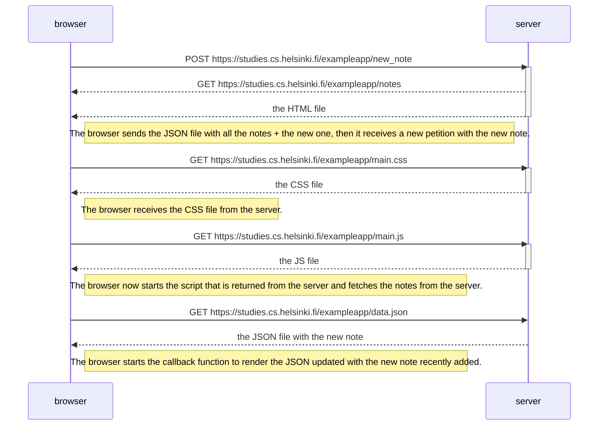

```mermaid
sequenceDiagram
    participant browser
    participant server

    browser->>server: POST https://studies.cs.helsinki.fi/exampleapp/new_note
    activate server
    server-->>browser: GET https://studies.cs.helsinki.fi/exampleapp/notes
    server-->>browser: the HTML file
    deactivate server

    Note right of browser: The browser sends the JSON file with all the notes + the new one, then it receives a new petition with the new note.

    browser->>server: GET https://studies.cs.helsinki.fi/exampleapp/main.css
    activate server
    server-->>browser: the CSS file
    deactivate server

    Note right of browser: The browser receives the CSS file from the server.

    browser->>server: GET https://studies.cs.helsinki.fi/exampleapp/main.js
    activate server
    server-->>browser: the JS file
    deactivate server

    Note right of browser: The browser now starts the script that is returned from the server and fetches the notes from the server.

    browser->>server: GET https://studies.cs.helsinki.fi/exampleapp/data.json
    server-->>browser: the JSON file with the new note

    Note right of browser: The browser starts the callback function to render the JSON updated with the new note recently added.
```
